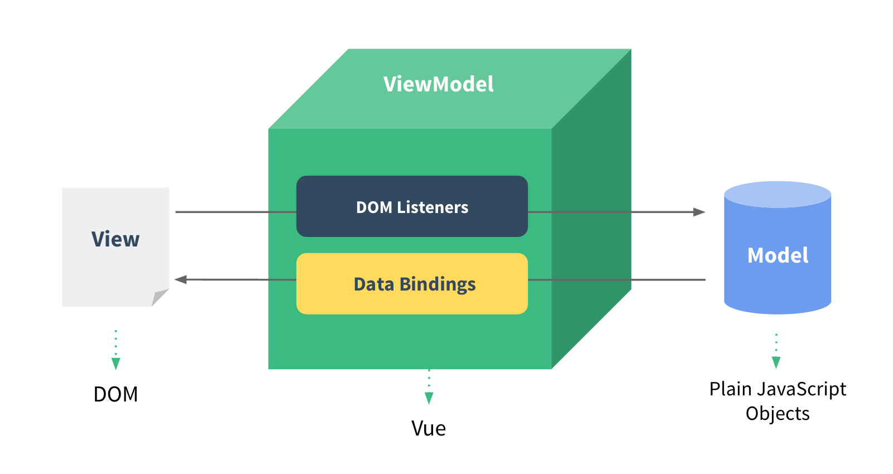
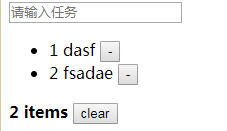

# study-vue

记录vue2学习

# 基础

## 简介

vue 是一个以数据驱动和组件化的MVVM模式的Javascript框架。



- 从View侧看，ViewModel中的DOM Listeners工具会帮我们监测页面上DOM元素的变化，如果有变化，则更改Model中的数据；
- 从Model侧看，当我们更新Model中的数据时，Data Bindings工具会帮我们更新页面中的DOM元素。

使用Vue的过程就是定义MVVM各个组成部分的过程：

1. 定义View
2. 定义Model
3. 定义Vue：需要传入选项对象，包含数据、挂载元素、方法、生命周期钩子

## 入门示例

```html
<!DOCTYPE html>
<html>
	<head>
		<meta charset="utf-8" />
		<title>vue 1</title>
		<script src="js/vue.js" type="text/javascript" charset="utf-8"></script>  @01
	</head>
	<body>
		<div id="app">                                                            @02
			{{ message }}                                                         @03
		</div>
	</body>
	
	<script>
		var app = new Vue({                                                       @04
			el: '#app',
			data: {
				message: 'Hello Vue!'
			}
		})
	</script>
</html>

```

- 01：引入vue，示例中使用过的本地引用，实际也可以在线引入，或者（[webpack](#webpack)）

  ```html
  <!-- 开发环境版本，包含了有帮助的命令行警告 --> <script src="https://cdn.jsdelivr.net/npm/vue/dist/vue.js"></script>
  
  <!-- 生产环境版本，优化了尺寸和速度 --> 
  <script src="https://cdn.jsdelivr.net/npm/vue"></script> 
  ```

  02：即html标签，id为app

- 03：vue挂载点数据

- 04：创建一个vue对象，包含如下几个部分

  - el：挂载点，除了可以挂载到id选择器，也可以是其他选择器如，class，标签等（一般选择id，因为唯一），vue对用范围，是挂载点及其子元素
  - data：数据对象，可以为简单对象，也可以是复杂对象（点取值），数组（下标取值）

## vue指令

vue指令是以v-开头的，作用域HTML元素的，这些指令为HTML元素提供了某种特性，可以根据需求实现自定义指令，vue有些常用的内置指令。

- v-text
- v-html
- v-if
- v-show
- v-else
- v-for
- v-bind（简写 :）
- v-on (简写 @)
- v-model

### v-test

占位显示数据，有两种形式：

> 1、作为标签属性(**替换整个标签内容**)
>
> ```html
> <h1 v-text="message"></h1>
> ```
>
> 2、直接使用{{}}
>
> ```html
> <h1>pre {{message}}</h1>
> ```

### v-html

占位显示数据，如果是html结构，则会按html解析显示，其他情况同v-text

```html
<body>
    <div id="app">
        <p v-html="context"></p>
    </div>
</body>

<script>
    var app = new Vue({
        el: '#app',
        data: {
            context: "<a href='www.baidu.com'>百度</a>"
        }
    })
</script>
```

### v-if/v-show

判断是否显示标签，v-if 通过dom操作完成元素是否显示，v-show通过样式操作元素是否显示


### v-else

配合v-if/v-show使用


### v-for

循环展示

```html
<input type="button" value="add" @click="add" />
<input type="button" value="remove" @click="remove" />
<ul>
	<li v-for="(item,index) in like" :title="item">
			{{index}} {{item}}
	</li>
</ul>
				
var app = new Vue({
    el: '#app',
    data: {
        like:[2,1,4,5]
    },
    methods:{
        add:function(){
            this.like.push(10)
        },
        remove:function(){
            this.like.shift()
        }
    }
})			
```


### v-bind

设置元素的属性，参数可以是class、style，表达式可以是字符串、函数调用、对象、数组等。

```html
<!--三目运算-->
<input type="button" value="字符串表达式绑定" :class="isActive?'active':''" @click="toggle" />

<!--对象-->
<input type="button" @click="对象绑定" :class="{active:isActive}"/>
```

### v-on

```html
<input type="button" value="事件(参数)" v-on:dblclick="dolt1(123,$event)"/>

<input type="button" value="事件绑定@" @dblclick="dolt()"/>
<input type="button" value="事件修饰符" @click.right="dolt2()"/>

methods:{
	dolt:function(){
		alert('你双击了！')
	},
	dolt1:function(p1,event){
		alert('你双了！'+event.toElement.value+' ,参数'+p1)
	},
	dolt2:function(){
		alert('右键点击')
	},
```

> [事件修饰符](https://vuejs.bootcss.com/api/#v-on)

v-model

与表单双向绑定

```html
<input type="text" value="message" v-model="message"/>
<p v-text="message"></p>
```

### 案例

- 添加列表
- 删除列表（目前仅实现鼠标放到列表上，显示所有删除按钮）
- 统计列表
- 清空列表
- 为空时，隐藏统计



```html
		<div id="app">
			<div id='top'>
				<input v-model="cinput" placeholder="请输入任务" @keyup.enter="add"/>
			</div>
		
	 		<div id='man'>
				<ul>
					<li v-for="(item,index) in tasklist">
						<div @mouseover="showr" @mouseleave="nshowr">
							<span>{{index+1}}</span>
							<label>{{item}}</label>
							<button @click="remove(index)" v-show="isShow">-</button>
						</div>
					</li>
				</ul>
			</div>
			<div id="buttom" v-show="tasklist.length!=0">
				<span><strong>{{tasklist.length}} items</strong></span>
				<button @click="clear">clear</button>
			</div>
			
		</div>
		
		<script>
			var app = new Vue({
				el: '#app',
				data: {
					cinput:'',
					tasklist:['衣','食']
				},
				methods:{
					add:function(){
						this.tasklist.push(this.cinput)
						this.cinput=''
					},
					remove:function(index){
						this.tasklist.splice(index,1)
					},
					clear:function(){
						this.tasklist = []
					}
				}
			})			
			
		</script>
```

## axios

网络接口调用,调用过程如下：

1、引入

```html
<script src="js/axios.min.js"></script>
```

2、调用

```html

_this = thisaxios.get("http://wthrcdn.etouch.cn/weather_mini?city="+this.city)
					.then(function(response){
						_this.weatherList=response.data.data.forecast
					},function(err){
						console.log(err)
					})
```

3、注意事项，会调用函数中this不再是Vue对象，所以如果需要在回调函数中操作Vue数据，需要提前将Vue对象重新引用

>  更多axios使用参考[中文文档](http://axios-js.com/zh-cn/docs/index.html)

### 案例

```html
<!DOCTYPE html>
<html>
	<head>
		<meta charset="utf-8" />
		<title>axios</title>
		<script src="js/vue.js" type="text/javascript" charset="utf-8"></script>
		<script src="js/axios.min.js"></script>
	</head>
	<body>

		<div id="app">
			<div>
				<input type="text" v-model="city"
				@keyup.enter="searchWeather" placeholder="请输入城市" />
				<button>搜索</button>
			</div>
			
			<div>
				<a href="javascript:;" @click="changeCity('北京')">北京</a>
				<a href="javascript:;" @click="changeCity('上海')">上海</a>
				<a href="javascript:;" @click="changeCity('深圳')">深圳</a>
				<a href="javascript:;" @click="changeCity('广州')">广州</a>
			</div>
			
			<div>
				<ul>
					<li v-for="item in weatherList">
						{{item}}
					</li>
				</ul>
			</div>
			
		</div>
		
	</body>
	
	<script>
	
		var app = new Vue({
			el:"#app",
			data:{
				city:'',
				weatherList:[]
			},
			methods:{
				searchWeather:function(){
					// console.log("this1:"+this)
					_this = this
					axios.get("http://wthrcdn.etouch.cn/weather_mini?city="+this.city)
					.then(function(response){
						_this.weatherList=response.data.data.forecast
					},function(err){
						console.log(err)
					})
				},
				changeCity:function(city){
					this.city = city
					this.searchWeather()
				}
			}
		})
		
	</script>
</html>

```


# 高级

# 技巧


# 专栏

## webpack


# 代办

- [ ] 基础-》案例：如何通过js或css实现鼠标放到某一项上显示此项的删除按钮