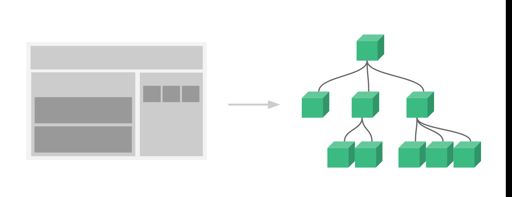
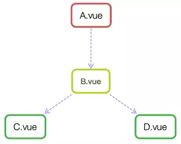

# 基础

## 简介

vue 是一个以数据驱动和组件化的MVVM模式的Javascript框架。


- 从View侧看，ViewModel中的DOM Listeners工具会帮我们监测页面上DOM元素的变化，如果有变化，则更改Model中的数据；
- 从Model侧看，当我们更新Model中的数据时，Data Bindings工具会帮我们更新页面中的DOM元素。

使用Vue的过程就是定义MVVM各个组成部分的过程：

1. 定义View
2. 定义Model
3. 定义Vue：需要传入选项对象，包含数据、挂载元素、方法、生命周期钩子

## 入门示例

```html
<!DOCTYPE html>
<html>
	<head>
		<meta charset="utf-8" />
		<title>vue 1</title>
		<script src="js/vue.js" type="text/javascript" charset="utf-8"></script>  @01
	</head>
	<body>
		<div id="app">                                                            @02
			{{ message }}                                                         @03
		</div>
	</body>
	
	<script>
		var app = new Vue({                                                       @04
			el: '#app',
			data: {
				message: 'Hello Vue!'
			}
		})
	</script>
</html>

```

- 01：引入vue，示例中使用过的本地引用，实际也可以在线引入，或者（[webpack](#webpack)）

  ```html
  <!-- 开发环境版本，包含了有帮助的命令行警告 --> <script src="https://cdn.jsdelivr.net/npm/vue/dist/vue.js"></script>
  
  <!-- 生产环境版本，优化了尺寸和速度 --> 
  <script src="https://cdn.jsdelivr.net/npm/vue"></script> 
  ```

  02：即html标签，id为app

- 03：vue挂载点数据

- 04：创建一个vue对象，包含如下几个部分

  - el：挂载点，除了可以挂载到id选择器，也可以是其他选择器如，class，标签等（一般选择id，因为唯一），vue对用范围，是挂载点及其子元素
  - data：数据对象，可以为简单对象，也可以是复杂对象（点取值），数组（下标取值）

## vue指令

vue指令是以v-开头的，作用域HTML元素的，这些指令为HTML元素提供了某种特性，可以根据需求实现自定义指令，vue有些常用的内置指令。

- v-text
- v-html
- v-if
- v-show
- v-else
- v-for
- v-bind（简写 :）
- v-on (简写 @)
- v-model

### v-test

占位显示数据，有两种形式：

> 1、作为标签属性(**替换整个标签内容**)
>
> ```html
> <h1 v-text="message"></h1>
> ```
>
> 2、直接使用{{}}
>
> ```html
> <h1>pre {{message}}</h1>
> ```

### v-html

占位显示数据，如果是html结构，则会按html解析显示，其他情况同v-text

```html
<body>
    <div id="app">
        <p v-html="context"></p>
    </div>
</body>

<script>
    var app = new Vue({
        el: '#app',
        data: {
            context: "<a href='www.baidu.com'>百度</a>"
        }
    })
</script>
```

### v-if/v-show

判断是否显示标签，v-if 通过dom操作完成元素是否显示，v-show通过样式操作元素是否显示


### v-else

配合v-if/v-show使用


### v-for

循环展示

```html
<input type="button" value="add" @click="add" />
<input type="button" value="remove" @click="remove" />
<ul>
	<li v-for="(item,index) in like" :title="item">
			{{index}} {{item}}
	</li>
</ul>
				
var app = new Vue({
    el: '#app',
    data: {
        like:[2,1,4,5]
    },
    methods:{
        add:function(){
            this.like.push(10)
        },
        remove:function(){
            this.like.shift()
        }
    }
})			
```


### v-bind

设置元素的属性，参数可以是class、style，表达式可以是字符串、函数调用、对象、数组等。

```html
<!--三目运算-->
<input type="button" value="字符串表达式绑定" :class="isActive?'active':''" @click="toggle" />

<!--对象-->
<input type="button" @click="对象绑定" :class="{active:isActive}"/>
```

> vue2.6增加动态属性绑定：
>
> <a v-bind:[attributeName]='url'>...</a>  attributeName可以是Vue实例中的data属性

### v-on

> [更多案例](https://cn.vuejs.org/v2/guide/events.html)

```html
<input type="button" value="事件(参数)" v-on:dblclick="dolt1(123,$event)"/>

<input type="button" value="事件绑定@" @dblclick="dolt()"/>
<input type="button" value="事件修饰符" @click.right="dolt2()"/>

methods:{
	dolt:function(){
		alert('你双击了！')
	},
	dolt1:function(p1,event){
		alert('你双了！'+event.toElement.value+' ,参数'+p1)
	},
	dolt2:function(){
		alert('右键点击')
	},
```

> [事件修饰符](https://vuejs.bootcss.com/api/#v-on)

### v-model

> [更多案例](https://cn.vuejs.org/v2/guide/forms.html)

与表单双向绑定

```html
<input type="text" value="message" v-model="message"/>
<p v-text="message"></p>
```

### 案例

- 添加列表
- 删除列表（目前仅实现鼠标放到列表上，显示所有删除按钮）
- 统计列表
- 清空列表
- 为空时，隐藏统计


```html
		<div id="app">
			<div id='top'>
				<input v-model="cinput" placeholder="请输入任务" @keyup.enter="add"/>
			</div>
		
	 		<div id='man'>
				<ul>
					<li v-for="(item,index) in tasklist">
						<div @mouseover="showr" @mouseleave="nshowr">
							<span>{{index+1}}</span>
							<label>{{item}}</label>
							<button @click="remove(index)" v-show="isShow">-</button>
						</div>
					</li>
				</ul>
			</div>
			<div id="buttom" v-show="tasklist.length!=0">
				<span><strong>{{tasklist.length}} items</strong></span>
				<button @click="clear">clear</button>
			</div>
			
		</div>
		
		<script>
			var app = new Vue({
				el: '#app',
				data: {
					cinput:'',
					tasklist:['衣','食']
				},
				methods:{
					add:function(){
						this.tasklist.push(this.cinput)
						this.cinput=''
					},
					remove:function(index){
						this.tasklist.splice(index,1)
					},
					clear:function(){
						this.tasklist = []
					}
				}
			})			
			
		</script>
```

## axios

网络接口调用,调用过程如下：

1、引入

```html
<script src="js/axios.min.js"></script>
```

2、调用

```html

_this = thisaxios.get("http://wthrcdn.etouch.cn/weather_mini?city="+this.city)
					.then(function(response){
						_this.weatherList=response.data.data.forecast
					},function(err){
						console.log(err)
					})
```

3、注意事项，会调用函数中this不再是Vue对象，所以如果需要在回调函数中操作Vue数据，需要提前将Vue对象重新引用

>  更多axios使用参考[中文文档](http://axios-js.com/zh-cn/docs/index.html)

### 案例

```html
<!DOCTYPE html>
<html>
	<head>
		<meta charset="utf-8" />
		<title>axios</title>
		<script src="js/vue.js" type="text/javascript" charset="utf-8"></script>
		<script src="js/axios.min.js"></script>
	</head>
	<body>

		<div id="app">
			<div>
				<input type="text" v-model="city"
				@keyup.enter="searchWeather" placeholder="请输入城市" />
				<button>搜索</button>
			</div>
			
			<div>
				<a href="javascript:;" @click="changeCity('北京')">北京</a>
				<a href="javascript:;" @click="changeCity('上海')">上海</a>
				<a href="javascript:;" @click="changeCity('深圳')">深圳</a>
				<a href="javascript:;" @click="changeCity('广州')">广州</a>
			</div>
			
			<div>
				<ul>
					<li v-for="item in weatherList">
						{{item}}
					</li>
				</ul>
			</div>
			
		</div>
		
	</body>
	
	<script>
	
		var app = new Vue({
			el:"#app",
			data:{
				city:'',
				weatherList:[]
			},
			methods:{
				searchWeather:function(){
					// console.log("this1:"+this)
					_this = this
					axios.get("http://wthrcdn.etouch.cn/weather_mini?city="+this.city)
					.then(function(response){
						_this.weatherList=response.data.data.forecast
					},function(err){
						console.log(err)
					})
				},
				changeCity:function(city){
					this.city = city
					this.searchWeather()
				}
			}
		})
		
	</script>
</html>

```

## vue-cli+webpack开发环境搭建

[环境](onenote://WANGXH-PC/Users/肖辉/Documents/OneNote 笔记本/前端/Vue.one#环境&section-id={3E135477-ACAE-4D78-B7D5-77F3DDC909FF}&page-id={80224FA0-41C3-44A1-AE7A-3BCA59CF9717}&end)

## 组件

组件系统是Vue.js其中一个重要的概念，它提供了一种抽象，让我们可以使用独立可复用的小组件来构建大型应用，任意类型的应用界面都可以抽象为一个组件树：



### 组件使用

组件的使用分三个步骤：创建组件构造器、注册组件、使用组件

```html
    <body>
		<div id="app">
             <!-- 3 使用组件 -->
			<mycomponent></mycomponent>
		</div>
	</body>
	<script>
		// 1 创建组件
		var  mycomponent = Vue.extend({
			template:'<div>this is a mycomponent</div>'
		})
		
		// 2 注册组件
		Vue.component('mycomponent',mycomponent)
		
		new Vue({
			el:'#app'
		})
	</script>
```

> 组件命名最好采用kebab-case：my-component-name
>
> [组件全局自动化注册](https://cn.vuejs.org/v2/guide/components-registration.html#%E5%9F%BA%E7%A1%80%E7%BB%84%E4%BB%B6%E7%9A%84%E8%87%AA%E5%8A%A8%E5%8C%96%E5%85%A8%E5%B1%80%E6%B3%A8%E5%86%8C)

**组件注册有两种方式，全局和局部**

- 全局：所有vue实例均可使用

  如上例

- 局部：定义实例可用

  ```html
          <div id="app2">
  			<mycomponent></mycomponent>
  			<localcomponent></localcomponent>
  		</div>
          
          var  mycomponent2 = Vue.extend({
  			template:'<div>this is a mycomponent2</div>'
  		})
          
          new Vue({
  			el:'#app2',
  			components:{
  				'localcomponent':mycomponent2
  			}
  		})
  ```

  **组件创建简写方式**

  ```html
  	Vue.component('mycomponent',{template: '<div>This is the third component!</div>'})
  	new Vue({
  			el:'#app2',
  			components:{
  				'localcomponent':{template: '<div>This is the third component!</div>'}
  			}
  		})
  ```

  **组件解耦**

  ```html
  	<div id="app">
  			<my-component1></my-component1>
  			<my-component2></my-component2>
  		</div>
  		
  		<script type="text/template" id="myComponent1">
  			<div>This is a script component</div>
  		</script>
  		<template id="myComponent2">
  			<div>This is a template component</div>
  		</template>
  		
  		<script type="application/javascript">
  			new Vue({
  				el: '#app',
  				components: {
  					// 局部注册，my-component1是标签名称
  					'my-component1': {
  						template: '#myComponent1'
  					},
  					// 局部注册，my-component2是标签名称
  					'my-component2': {
  						template: '#myComponent2'
  					}
  				}
  			});
  		</script>
  ```

### 父子组件

```html
<div id="app">
			<parent-component></parent-component>
		</div>
		
		<template id="chirld-component">
			<div>This is a chirld component</div>
		</template>
		
		<template id="parent-component">
			<div>
				<div>This is a parent component</div>
				<div><chirld-component></chirld-component></div>
			</div>
		</template>
		<script>
			new Vue({
				el:'#app',
				components:{
					"parent-component":{
						template:'#parent-component',
						components:{
							"chirld-component":{
								template:'#chirld-component'
							}
						}
					}
				}
			})
		</script>
```

> 组件模板（<template>中只能有一个跟元素）

## Vue实例

创建Vue实例对象的完整选项，参考[API文档](https://cn.vuejs.org/v2/api/#%E9%80%89%E9%A1%B9-%E6%95%B0%E6%8D%AE)

- 数据
  - data
  - props 接收父组件数据
  - computed 计算属性
  - methods
  - watch 监听属性变化
- DOM
  - el Vue实例挂载点
  - template Vue实例模板，替换挂载点元素，（插槽除外）
  - render 渲染函数，可以发挥JS的编程能力，如果Vue选项存在render则Vue构造函数不会从template或挂载点中提取HTML

> Vue 实例提供了一些内置属性和方法，都以$最为前缀，如vm.$data、vm.$watch

- 生命周期

  

# 高级


### 组件通信

组件间相互组合，构成了父子、兄弟、隔代等关系，而组件实例的作用域又是相互隔离的，这就意味着组件间数据无法相互引用，此时就需要一种通讯机制。



#### props和\$emit
可以通过props实现父组件向子组件传递数据，使用\$emit(通过自定义事件)实现子组件数据向父组件数据传递

```html
<div id="app">
			<table>
				<tr>
					<th colspan="3">父组件数据</th>
				</tr>
				<tr>
					<td>名字</td>
					<td>{{name}}</td>
					<td><input type="text" v-model="name" /></td>
				</tr>
				<tr>
					<td>年龄</td>
					<td>{{age}}</td>
					<td><input type="text" v-model="age" /></td>
				</tr>

			</table>
			<!--通过v-bind:my-name="name"实现父子组件的单向数据绑定，通过v-on:change-nam="setName" 自定义事件实现子向父的数据传递-->
			<my-component :my-name="name" :my-age="age" :my-person="person" @change-name="setName" @change-age="setAge"></my-component>
		</div>
		<template id="myComponent">
			<table>
				<tr>
					<th colspan="3">子组件数据</th>
				</tr>
				<tr>
					<td>名字</td>
					<td>{{myName}}</td>
					<td><input type="text" v-model="myName" /></td>
				</tr>
				<tr>
					<td>年龄</td>
					<td>{{myAge}}</td>
					<td><input type="text" v-model="myAge" /></td>
				</tr>
				<tr>
					<td>{{myPerson.name}}</td>
					<td>{{myPerson.age}}</td>
				</tr>
			</table>
		</template>
		<script>
			var vm = new Vue({
				el: "#app",
				data: {
					name: "小明",
					age: 24,
					person:{
						name:'wxh',
						age:'26'
					}
				},
				components: {
					'my-component': {
						template: "#myComponent",
						// props: ["myName", "myAge","myperson"],
						props:{
							myName:String,
							myAge:Number,
							myPerson:Object
						},
						watch: { //监听外部对props属性myName,myAge的变更
							myName: function(val) {
								this.$emit("change-name", val) //组件内对myName变更后向外部发送事件通知
							},
							myAge: function(val) {
								this.$emit("change-age", val) //组件内对myAge变更后向外部发送事件通知
							}
						}
					}
				},
				methods: {
					setName: function(val) {
						this.name = val; //外层调用组件方法注册变更方法，将组件内的数据变更，同步到组件外的数据状态中
					},
					setAge: function(val) {
						this.age = val;
					}
				}
			})
		</script>
```

```html
<div id="app">
			<ol>
				<todo-item v-for="item in groceryList" v-bind:todo="item" v-bind:key='item.id'></todo-item>
			</ol>
		</div>
		
		<script>
			Vue.component('todo-item',{
				props: ['todo'],
				template: '<li>{{ todo.text }}</li>'
			})
			
			new Vue({
				el:'#app',
				data:{
					groceryList:[
						{id:0,text:'蔬菜'},
						{id:1,text:'奶酪'},
						{id:2,text:'吃的东西'}
					]
				}
			})
		</script>
```


>HTML 中的 attribute 名是大小写不敏感的，所以浏览器会把所有大写字符解释为小写字符。这意味着当你使用 DOM 中的模板时，camelCase (驼峰命名法) 的 prop 名需要使用其等价的 kebab-case (短横线分隔命名) 命名

#### `$attrs` & `$listeners` 

> 组件封装用的较多

### 组件导出和引用

#### export 

导出模块，可以导出常量、函数、文件、模块等

```
export var name="李四";

 var name1="李四";
 var name2="张三";
 export { name1 ,name2 }
 
 function add(x,y){
   alert(x*y)
  //  想一想如果这里是个返回值比如： return x-y，下边的函数怎么引用
}
export { add }
```

#### export default

同export，不同点如下：

- export default只能有一个
- 导入时，export需要{} 而export default不需要

#### import

Vue是通过webpack实现模块化，可以使用import引入模块

> bulid/webpack.base.conf.js中配置module.exports = ..resolve....，
>
> resolve: {
>  extensions: ['.js', '.vue', '.json'],
>  alias: {
>    'vue$': 'vue/dist/vue.esm.js',
>    '@': resolve('src'),
>  }
> }
>
> 模块可以省略 ".js"，".vue"，“.json” 后缀，weebpack 会在之后自动添加上；可以用 "@" 符号代替 "src" 字符串等。

#### require

require理论上可以运用在代码的任何地方,import是编译时的，require是运行时的。**推荐使用import**

# 插件

## router

### 准备

> [官方文档注释版](https://juejin.im/post/6844903665388486664#heading-37)
>
> [应用版](https://juejin.im/post/6844903608534695943#heading-14)

- router本质就是:建立并管理url和对应组件之间的映射关系
  - Html:对应的就是vue-router里的`router-link`和`router-view`
  - JavaScript:就是具体路由实例的配置. 
  - 整个vue-router的配置也是围绕这两个层面进行展开的,学习时一定要有这个意识,才更容易理解和使用!

### router主要标签

- router-link组件来导航,用户点击后切换到相关视图，最终渲染成a标签

- router-view组件来设置切换的视图在哪里渲染.(一个页面也可以有多个router-view分别展示特定的视图,并且支持嵌套，即命名视图)

  ```html
  <script src="https://unpkg.com/vue/dist/vue.js"></script>
  <script src="https://unpkg.com/vue-router/dist/vue-router.js"></script>
  
  <div id="app">
    <h1>Hello App!</h1>
    <p>
      <!-- 使用 router-link 组件来导航. -->
      <!-- 通过传入 `to` 属性指定链接. -->
      <!-- <router-link> 默认会被渲染成一个 `<a>` 标签 -->
      <router-link to="/foo">Go to Foo</router-link>
      <router-link to="/bar">Go to Bar</router-link>
    </p>
    <!-- 路由出口 -->
    <!-- 路由匹配到的组件将渲染在这里 -->
    <router-view></router-view>
  </div>
  ```

### 路由实现模式

SPA(single page application):单一页面应用程序，只有一个完整的页面；它在加载页面时，不会加载整个页面，而是只更新某个指定的容器中内容。**单页面应用(SPA)的核心之一是: 更新视图而不重新请求页面**;vue-router在实现单页面前端路由时，提供了两种方式：Hash模式和History模式；根据mode参数来决定采用哪一种方式。

#### hash模式

**vue-router 默认 hash 模式 —— 使用 URL 的 hash 来模拟一个完整的 URL，于是当 URL 改变时，页面不会重新加载。** hash（#）是URL 的锚点，代表的是网页中的一个位置，单单改变#后的部分，浏览器只会滚动到相应位置，不会重新加载网页，也就是说**hash 出现在 URL 中，但不会被包含在 http 请求中，对后端完全没有影响，因此改变 hash 不会重新加载页面**；同时每一次改变#后的部分

#### history模式（实际项目中推荐使用）

这种模式利用了HTML5 History新增的**pushState()和replaceState()方法.**使用History模式,通过历史记录修改url,但它不会立即向后端发送请求. **`注意点:`** 虽然History模式可以丢掉不美观的#,也可以正常的前进后退,但是刷新f5后,此时浏览器就会访问服务器,在没有后台支持的情况下,此时就会得到一个404!要在服务端增加一个覆盖所有情况的的候选资源;如果url匹配不到任何静态资源,则应该返回同一个index.html页面."

> 1. 使用hash的方式, 当hash改变时, 会触发hashchange事件, 而不会刷新页面, 比如: 在页面内点击带有锚点的a标签, 不会刷新页面, 可以参考[阮老师的博文](http://www.ruanyifeng.com/blog/2011/03/url_hash.html)
> 2. 使用history, 一般都需要服务器端配置或支持SSR, 否则服务器会返回404

### 实际开发中应用步骤

1,材料准备:

- 1.1 引入准备好的'Vue'和'vue-router'(前提是已经npm)
- 1.2 引入路由跳转的组件.下面例子中就是'Foo'和'Bar'
- 1.3 启动全局组件VueRouter例如:Vue.use(VueRouter).这样vue-router才开始执行.

2, 配置路由实例:通过new VueRouter()详细配置每个路由的路径,对应的组件等等所有和路由相关的配置.

3, 将路由实例挂载到根实例上.new Vue({router}).$mount('#app')

```vue
// 0. 如果使用模块化机制编程，导入Vue和VueRouter，要调用 Vue.use(VueRouter)

// 1. 定义 (路由) 组件。
// 可以从其他文件 import 进来
const Foo = { template: '<div>foo</div>' }
const Bar = { template: '<div>bar</div>' }

// 2. 定义路由
// 每个路由应该映射一个组件。 其中"component" 可以是
// 通过 Vue.extend() 创建的组件构造器，
// 或者，只是一个组件配置对象。
// 我们晚点再讨论嵌套路由。
const routes = [
  { path: '/foo', component: Foo },
  { path: '/bar', component: Bar }
]

// 3. 创建 router 实例，然后传 `routes` 配置
// 你还可以传别的配置参数, 不过先这么简单着吧。
const router = new VueRouter({
  routes // (缩写) 相当于 routes: routes
})

// 4. 创建和挂载根实例。
// 记得要通过 router 配置参数注入路由，
// 从而让整个应用都有路由功能
const app = new Vue({
  router
}).$mount('#app')

// 现在，应用已经启动了！
```

> - `$router`是指整个**路由实例**,你可以操控整个路由,通过'$router.push'往其中添加任意的路由对象.
> - `$route`:是指当前路由实例('$router')跳转到的**路由对象**;

#### html 部分

##### **router-link**

- to

  表示目标路由的链接。当被点击后，内部会立刻把 `to` 的值传到 `router.push()`，所以这个值可以是一个字符串或者是描述目标位置的对象。

  ```html
  <!-- 字符串 -->
  <router-link to="home">Home</router-link>
  <!-- 渲染结果 -->
  <a href="home">Home</a>
  
  <!-- 使用 v-bind 的 JS 表达式 -->
  <router-link v-bind:to="'home'">Home</router-link>
  
  <!-- 不写 v-bind 也可以，就像绑定别的属性一样 -->
  <router-link :to="'home'">Home</router-link>
  
  <!-- 同上 -->
  <router-link :to="{ path: 'home' }">Home</router-link>
  
  <!-- 命名的路由 -->
  <router-link :to="{ name: 'user', params: { userId: 123 }}">User</router-link>
  
  <!-- 带查询参数，下面的结果为 /register?plan=private -->
  <router-link :to="{ path: 'register', query: { plan: 'private' }}">Register</router-link
  >
  ```

  

- replace

  设置 `replace` 属性的话，当点击时，会调用 `router.replace()` 而不是 `router.push()`，于是导航后不会留下 history 记录。

  ```html
  <router-link :to="{ path: '/abc'}" replace></router-link>
  ```

  

##### **router-view**(单页面多视图)

匹配路由站位符，嵌套组合命名视图，没有指定名称的为：default

```html
<div id="app">
    <router-link :to="{name:'HelloWorld'}">主页</router-link>
    <router-link to="H1">H1页面</router-link>
    <router-link :to="{name:'H2'}">H2页面</router-link>
    <router-view/>
    <router-view name="left" style="float: left;width: 50%; background-color: #3190E8; height: 18.75rem;"></router-view>
    <router-view name="right" style="float: right;width: 50%; background-color:#42B983; height: 18.75rem;"></router-view>
  </div>
```

对应路由组件配置：(**注意是components，而不是component**)

```js
  path: '/',
  name: 'HelloWorld',
  components:{default: HelloWorld,left: H1,right: H2},
```

#### js部分

##### **路由引入**

```
import Vue from 'vue'
import Router from 'vue-router'
Vue.use(Router)
```

##### **组件导入（懒加载）**

组件导入有两种方式，正常导入和懒加载方式

> [懒加载](https://segmentfault.com/a/1190000011519350)(按需加载)

```js
// 一般导入
import H1 from '../components/H1.vue'
import H2 from '../components/H2.vue'

var MardownIt = require("markdown-it")

//按需导入

const H1 = () => import('../components/H1.vue')
const H2 = () => import('../components/H2.vue')

 path: '/h1',
 name: 'H1',
 component: H1（H2）
 
 component:r => require.ensure([], () => r(require('../components/')), 'H1')
```

> 将组件按组分块
>
> const H1 = () => import(/* webpackChunkName: "group-h" */ '@/components/H1.vue')
> const H2 = () => import(/* webpackChunkName: "group-h" */ '@/components/H2.vue')
>
> 使用按组分块的前提：
>
> ​	需要在webpack.base.conf.js里面的output里面的filename下面加上chunkFileName
> ​	filename: '[name].js',
> ​		// 需要配置的地方
> ​	chunkFilename: '[name].js',


> **懒加载方式，打包之后不同组件会单独打包**

> [`import`和`require`都是被模块化所使用](https://blog.csdn.net/weixin_44309374/article/details/100916617)
>
> 遵循规范
>
> - `require` 是 AMD规范引入方式
> - `import`是es6的一个语法标准，如果要兼容浏览器的话必须转化成es5的语法
>
> 调用时间
>
> - require是运行时调用，所以require理论上可以运用在代码的任何地方
> - import是编译时调用，所以必须放在文件开头
>
> 本质
>
> - require是赋值过程，其实require的结果就是对象、数字、字符串、函数等，再把require的结果赋值给某个变量
> - import是解构过程，但是目前所有的引擎都还没有实现import，我们在node中使用babel支持ES6，也仅仅是将ES6转码为ES5再执行，import语法会被转码为require

##### **定义路由配置**（嵌套路由）

```js
const routes = [
  {
      path: '/',
      name: 'HelloWorld',
      components:{default: HelloWorld,left: H1,right: H2},
      children:[
        {
            path: '/h1',
            name: 'H1',
            component: H1
        },
        {
            path: '/h2',
            name: 'H2',
            component: H2
        }
      ]
  }
]
```

> children 嵌套路由

##### **导出路由**

```js
export default new Router({
  	mode: 'history',
	routes
})
```

##### main.js挂载路由

```js
import router from './router'
new Vue({
  el: '#app',
  router,
  components: { App },
  template: '<App/>'
})
```

### 动态路由

动态路由的本质通过URL进行参数传递

#### 使用params配置

```js
routes:[{
	//动态路径参数,以冒号开头
	path:'/user/:id',
	component:User
}]
```

```html
 <router-link to="/user/wxh">wxh</router-link>
 <router-link to="/user/xiaolizi">xiaolizi</router-link>
```

> - 一个路径参数使用':'冒号进行标记.
> - 当匹配到一个路由时,参数就会被设置到`this.$route.params`

| **模式**                      | **匹配路径**        | **$route.params**                    |
| ----------------------------- | ------------------- | ------------------------------------ |
| /user/:username               | /user/evan          | `{ username: 'evan' }`               |
| /user/:username/post/:post_id | /user/evan/post/123 | `{ username: 'evan', post_id: 123 }` |

>由于路由参数对组件实例是复用的.例如:`/user/foo` 和 `/user/bar`在使用路由参数时,复用的都是`User`组件.此时组件的生命周期钩子不会再被调用(**因为同一组件**)。如果你想路径切换时,进行一些初始化操作时,可以用以下两种解决办法:
>
>1、在组件内 watch `$route` 对象：
>
>```js
>const User = {
> template: '...',
> watch: {
>   '$route' (to, from) {
>     // 对路由变化作出响应...
>   }
> }
>}
>
>```
>
>2、使用2.2版本中的 beforeRouteUpdate 路由守卫：
>
>```js
>const User = {
>  template: '...',
>  beforeRouteUpdate (to, from, next) {
>	// react to route changes...
>	// don't forget to call next()
>  }
>}
>```
>
>

#### 使用query配置

```js
<router-link to="/user?id=foo">foo</router-link> 
```

vue-route会自动将?后的id=foo封装进this.$route.query里. 

### 编程式导航

**一般什么时候用到编程式导航?** 如果,你想在路由跳转前做点其他事情,例如权限验证等.但是用``的话,就直接跳转了.此时就可以使用编程式导航!

#### push

编程式导航一般都是用到router.push方法.该方法的参数可以是一个字符串路径,或者一个描述地址的对象.例如:

```js
//字符串
this.$router.push('home')

//对象
this.$ruter.push({path:'home'})

//命名路由
this.$router.push({name:'user',params:{userId:2333}})

//带查询参数,变成/register?plan=private
this.$router.push({path:'register',query:{plan:'private'}})
```

> path不能和params同时使用，使用path时params不生效

#### replace

router.replace和router.push很像,写法一样.但实际效果不一样.push是向history里添加新记录.**而replace是直接将当前浏览器history记录替换掉!**

#### go(n)

前进或后退n步，类似于window.history.go(n)

### 路由重定向和别名

#### 重定向

redirect：可以是字符串、对象、函数

```js
//从 /a 重定向到 /b
const router = new VueRouter({
	routes:[
		{path:'/a',redirect:'/b'}
	]
})

///从 /a 重定向到 命名为'foo'的路由
const router = new VueRouter({
  routes: [
    { path: '/a', redirect: { name: 'foo' }}
  ]
})

//甚至是一个方法，动态返回重定向目标：
const router = new VueRouter({
  routes: [
    { path: '/a', redirect: to => {
      // 方法接收 目标路由 作为参数
      // return 重定向的 字符串路径/路径对象
	  const { hash, params, query } = to
	  //这里使用了ES6的解构写法,分别对应了to的hash模式,params,query参数.这里解构就不具体说明了.
        if (query.to === 'foo') {
          return { path: '/foo', query: null }
        }
        if (hash === '#baz') {
          return { name: 'baz', hash: '' }
        }
        if (params.id) {
          return '/with-params/:id'
        } else {
          return '/bar'
        }
    }}
  ]
})
```

#### 别名

即两个路径都指向同一个目的地

```js
const router = new VueRouter({
//这时,路径'/fxxksky'和'/two-dogs' 都会跳转到A
  routes: [
    { path: '/fxxksky', component: A, alias: '/two-dogs' }
	//当有多个别名时,alias也可以写成数组形式.  alias: ['/two-dogs', 'three-dogs','four-dogs','five-dogs'] 
  ]
})
```


# 技巧

# 专栏

## webpack

## element-ui

### [导航栏](https://element.eleme.io/#/zh-CN/component/menu)

```html
<template>
	<div class="manage_page fillcontain">
		<el-row style="height: 100%;">
	  		<el-col :span="4"  style="min-height: 100%; background-color: #324057;">
				<el-menu :default-active="defaultActive" style="min-height: 100%;" theme="dark" router>
					<el-menu-item index="manage"><i class="el-icon-menu"></i>首页</el-menu-item>
					<el-submenu index="2">
						<template slot="title"><i class="el-icon-document"></i>数据管理</template>
						<el-menu-item index="userList">用户列表</el-menu-item>
						<el-menu-item index="shopList">商家列表</el-menu-item>
					</el-submenu>
					<el-submenu index="3">
						<template slot="title"><i class="el-icon-plus"></i>添加数据</template>
						<el-menu-item index="addGoods">添加商品</el-menu-item>
                        <el-menu-item index="/addGoodsssss">添加商品2</el-menu-item>
                    </el-submenu>
				</el-menu>
			</el-col>
			<el-col :span="20" style="height: 100%;overflow: auto;">
				<keep-alive>
				    <router-view></router-view>
				</keep-alive>
			</el-col>
		</el-row>
  	</div>
</template>

<script>
    export default {
		computed: {
			defaultActive: function(){
				return this.$route.path.replace('/', '');
			}
		},
    }
</script>
```

> 1. el-menu标签中有两个重要属性
>
>    default-active：高亮显示
>
>    router：是否使用 vue-router 的模式，启用该模式会在激活导航时以 index 作为 path 进行路由跳转（其中   index前可以带‘/’也可以不带）
>
>    
>
> 2. keep-alive
>
>    标签切换状态保持
>
>    
>
> 3. computed
>
>    由于el-menu-item属性index没有使用‘/’前缀所以高亮显示default-active值需要删除路由'/''.例如：
>
>    route.path:/userList     default-active:userList
>
> 4. 扩展
>
>    根据配置的路由信息，自动生成导航栏
>
>    https://www.jianshu.com/p/c964a988b143

```js
const routes = [
	{
		path: '/',
		component: login
	},
	{
		path: '/manage',
		component: manage,
		name: '',
		children: [{
			path: '',
			component: home,
			meta: [],
		},{
			path: '/addGoods',
			component: addGoods,
			meta: ['添加数据', '添加商品'],
		},{
			path: '/userList',
			component: userList,
			meta: ['数据管理', '用户列表'],
		},{
			path: '/shopList',
			component: shopList,
			meta: ['数据管理', '商家列表'],
		}]
	}
]
```

### [面包屑](https://element.eleme.io/#/zh-CN/component/breadcrumb)

```html
         <el-breadcrumb separator="/">
			<el-breadcrumb-item :to="{ path: '/manage' }">首页</el-breadcrumb-item>
			<el-breadcrumb-item v-for="(item, index) in $route.meta">{{item}}</el-breadcrumb-item>
		</el-breadcrumb>
```

> 1. separator指定分隔符
> 2. to 指定目标路径
> 3. meta 路由元数据

# 代办

- [ ] 基础-》案例：如何通过js或css实现鼠标放到某一项上显示此项的删除按钮